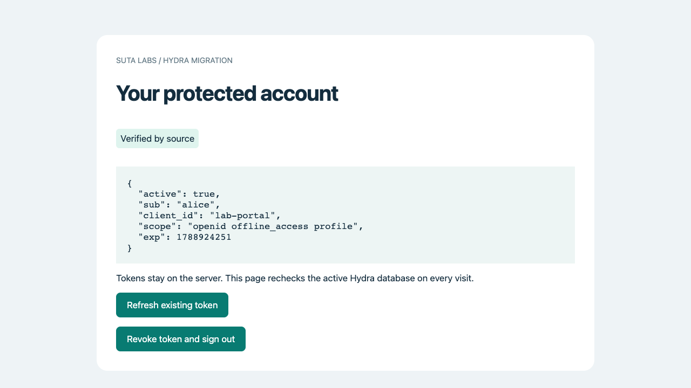

# 2. Restore data and run Hydra

**Result:** a working login application backed by Aurora MySQL, with at least 35 GiB of logical client data.

Hydra is Ory's real OAuth server. The practice portal is the separate login and
consent interface included with this lab; it is not an official Hydra dashboard.
Alice and Bob are synthetic test identities. You will keep Alice's session during
the migration and test it again on PostgreSQL.

The SQL fixture contains real Hydra table definitions and generated client
records. Most of its volume is repeated metadata. Using the portal creates actual
Hydra consent and token records. No customer production data is included.

## A few words you will use

- A **client** is an application that uses Hydra, such as this practice portal. The millions of sample client records are fake application registrations, not millions of people.
- An **access token** lets the portal ask Hydra whether Alice or Bob may open the protected account.
- A **refresh token** lets the portal get a new access token without asking the person to sign in again.
- **Revoke** means asking Hydra to stop accepting a token. You will test that the revoked token cannot be reused.
- The database **schema** is its table layout: column names, types and rules. Restoring the SQL file creates the MySQL layout and fills it with sample data.

## What you will see change

You start with an empty MySQL database. After the restore, it contains the sample clients. After you start Hydra and sign in as Alice, Hydra creates real login and token records. You will later check that Alice can still use those records after the database switch.

## Install the app and database clients

In the AWS Console, search for **EC2**, choose **Instances**, select your runner from task 1 and choose **Connect → Session Manager → Connect**. Follow the shared terminal and SQL steps below. These are the same whether you created AWS resources in the Console or with the CLI.

You create the database users, download the application, write your private settings and initialize Hydra's native PostgreSQL schema. Keep target Hydra stopped. The source must still be empty for the restore.

<details class="instructions" markdown="1">
<summary>Install Hydra, create the SQL users and initialize the empty PostgreSQL schema</summary>

{{lesson:../02-aws/application.md}}

</details>

## Restore the source yourself

Download the supplied SQL fixture, verify its checksum and import it with the MySQL client on your runner. AWS Console creates the database; the MySQL client restores this logical SQL file.

For this complete lab, choose the **35g** fixture. The small fixture is an optional rehearsal; if you use it first, follow the documented reset before restoring the full fixture. The completion checkpoint requires the full 35 GiB logical dataset, measured with SQL. The compressed download size and allocated disk space are different measurements.

<details class="instructions" markdown="1">
<summary>Restore MySQL, measure the data, start Hydra and sign in</summary>

{{lesson:../03-data/build.md}}

</details>

## Expected results along the way

These are the full fixture's results **before you start Hydra**. The restore instructions show the SQL used to check them.

| Check | Expected result | What it means |
|---|---|---|
| Download checksum | `hydra-source-demo-35g.sql.gz: OK` | The downloaded file matches the published file. |
| Import exit status | `restore_exit=0` | The SQL import finished without a reported error. |
| Number of tables | `15` | Fourteen data tables plus Hydra's migration history. |
| Client records | `2236700` | All sample clients were restored. |
| Network records | `1` | The clients have their required parent network. |
| Migration history records | `206` | The fixture contains the pinned Hydra schema history. |

After starting the app, Hydra adds its portal client and creates records as you sign in. Save your new counts; do not expect every count to stay at the fixture value.

In Alice's **Protected account**, expect **Verified by source**. The token details should include the values below; other fields and expiry times vary:

```json
{"active": true, "sub": "alice", "client_id": "lab-portal"}
```

Select **Refresh existing token**. Alice should remain signed in, and the page should still say **Verified by source**. This is your working baseline for the migration.

### What the working source app looks like

This screenshot is from the AWS rehearsal. Check **Verified by source**, `active: true` and Alice's subject. Your expiry value will differ.



## Check before continuing

- Your SQL restore completed without errors.
- The source has 14 data tables plus its migration history.
- Your measurement is at least 35 GiB of logical client data.
- Alice can sign in, open Protected account and refresh an existing token.
- The portal reports **Verified by source**. Target Hydra remains stopped.

Keep passwords, cookies and tokens private. Record sizes, counts and results instead.

[Previous: 1. Build the source and target](01-build.md) · [Next: 3. Assess the schema with SCT](03-sct.md)
