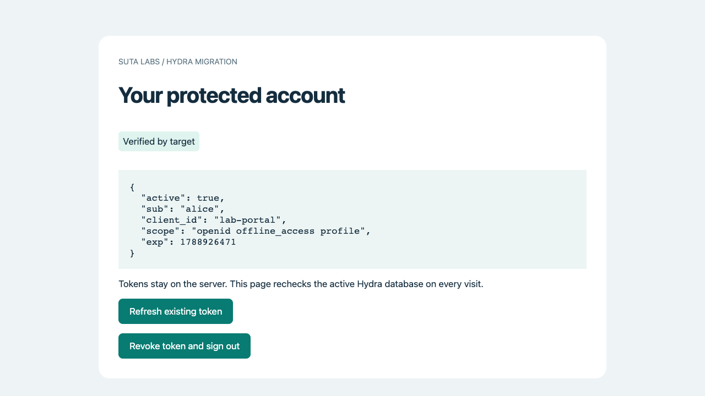
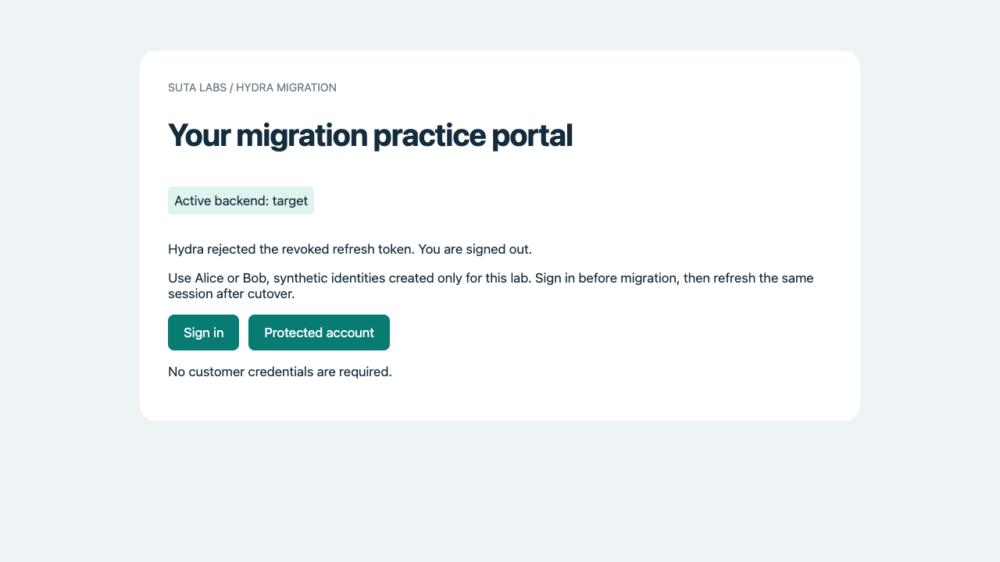

# 6. Prove it works and clean up

**Result:** evidence that the migration preserved existing access and supports new activity.

Use the portal in your browser. A copied table count alone does not prove a working application.

## Comcast's final check

Alice represents someone who was already signed in before the migration. Bob represents someone who signs in afterward. The team needs both cases to work before it accepts the result.

Keep the AWS Console open at **DMS → Database migration tasks**. The migration task should remain **Stopped** while you test. All new activity now belongs in PostgreSQL.

## Test the application

- In Alice's original browser session, open **Protected account**. Require **Verified by target**, active status and Alice's original subject.
- Select **Refresh existing token**. Require success on target without signing in again.
- Open a private window and sign in as Bob. Approve consent and open Protected account.
- Refresh Bob's token. Then select **Revoke token and sign out**. Protected account must require sign-in again. Require **Hydra rejected the revoked refresh token** on the sign-out confirmation.
- Compare the discovery issuer and public JWKS saved before and after cutover. The issuer and existing signing key must remain available.
- Record the outage from the time you stopped the gateway to the first successful target request. Include time spent waiting for checks; do not report only the container start time.

If a check fails, keep the evidence and diagnose it before marking the lab complete. See [cutover recovery](../06-cutover/survive.md) for the recovery boundary and [incident exercises](../07-incidents/build.md) for additional practice.

## Expected results in the portal

| Action | Expected result | If it differs |
|---|---|---|
| Alice opens her existing account | **Verified by target**, `active: true`, `sub: alice` | Check that the route points to target and that the original portal session remains. |
| Alice refreshes | Refresh succeeds on target without another login. | Check the copied refresh record and unchanged Hydra secrets. |
| Bob signs in in a private window | **Verified by target**, `active: true`, `sub: bob` | Check target logs and database permissions. |
| Bob revokes and signs out | **Hydra rejected the revoked refresh token. You are signed out.** | A generic error is not a successful revocation check. |
| Bob opens Protected account again | The portal asks him to sign in. | Do not mark the lab complete while revoked access remains usable. |

Token values, session IDs and timestamps will differ from the author's run. Keep them private. Record the subject, backend and pass or failure instead.

### Compare your app with the tested result

Alice's original browser session after cutover and refresh:

Bob's confirmation after Hydra rejected his revoked refresh token:

These screenshots show the author's AWS run. Complete the same checks in your own lab and save your own results.

## Save the result

| Evidence | Your observed result |
|---|---|
| Source logical data size and restore result | |
| SCT assessment and resolved action items | |
| DMS full-load duration and 14-table results | |
| CDC insert, update and delete | |
| Final validation, row counts and foreign keys | |
| Alice's retained access and refresh | |
| Bob's new login, refresh and revocation | |
| Issuer, signing key and outage duration | |

## Clean up your resources

When you finish practising, follow one cleanup route. Check every resource name against your worksheet. Create and verify the requested final snapshots before deleting databases. Retained snapshots and backups continue to incur charges until you remove them according to your retention decision.

AWS Console: save evidence and remove your lab resources

{{lesson:../08-handover/console.md}}

CLI alternative: save evidence and remove your lab resources

{{lesson:../08-handover/build.md}}

**Complete:** you built the source and target, restored data, used SCT and DMS, cut over the app, tested existing and new sessions, and recorded cleanup or an agreed retention date.

[Previous: 5. Cut over to PostgreSQL](05-cutover.md)
